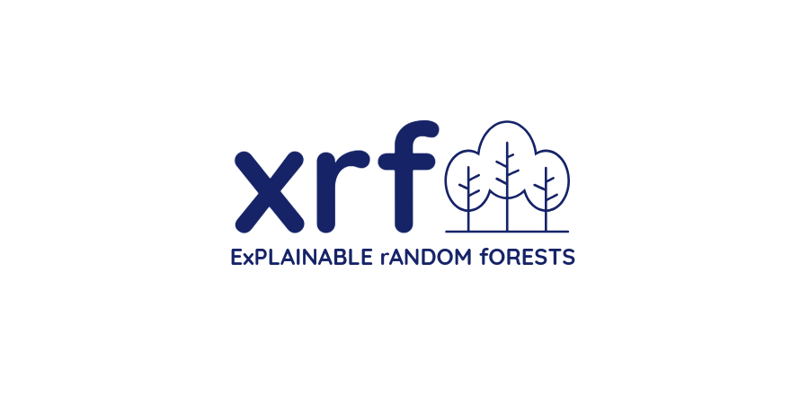

.. raw:: html

   

.. title:: xrf

``xrf`` is a Python package that implements random forest classifiers
and regressors with example attribution, i.e., the predictions are
associated with weight distributions over the training examples, where
each prediction is the scalar product of the weights and targets of
the training examples. The examples that are used when forming
predictions can be constrained by their number or by their cumulative
weight. When not constrained, the predictions are identical to what is
output by random forest classifiers and regressors as implemented in
[scikit-learn](https://scikit-learn.org/)

.. raw:: html

   

  
.. toctree::
    :maxdepth: 1
    
    Getting started <getting_started.rst>
    The xrf package <xrf>	      
    Examples <xrf.ipynb>
    Citing xrf <citing.md>
